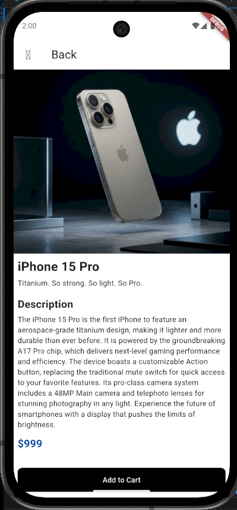
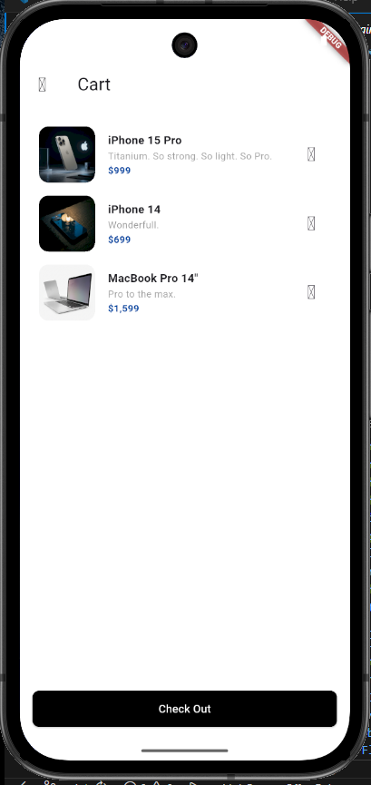

# Mini Katalog Uygulaması (Flutter Project)

Bu proje, staj eğitim programı kapsamında geliştirilmiş, temel seviyede ancak profesyonel standartlara uygun bir mobil katalog uygulamasıdır. Haftalık eğitim müfredatındaki widget yapısı, sayfa geçişleri ve veri modelleri konularını kapsar.

## 📱 Proje Özellikleri
- **Katalog Ekranı (Discover):** GridView kullanılarak oluşturulmuş, ürünlerin yan yana listelendiği ana sayfa.
- **Ürün Detay Sayfası:** Navigator ve Route Arguments kullanılarak seçilen ürünün detaylarının gösterildiği dinamik ekran.
- **Sepet Simülasyonu:** SnackBar yapısı ile kullanıcı etkileşimi (Checkout süreci).
- **Veri Modeli:** Dart sınıfları ile oluşturulmuş tutarlı veri yapısı.

## 🛠 Kullanılan Teknolojiler & Sürüm Bilgileri
- **Framework:** Flutter 3.x (Stable)
- **Language:** Dart 3.x
- **UI:** Material Design 3

## 📁 Proje Klasör Yapısı
Yönergeye uygun olarak proje aşağıdaki mimariyle organize edilmiştir:
- `lib/components`: Sık kullanılan yapıların bulunduğu ksıım.
- `lib/model`: Veri modelleri.
- `lib/servıces`: Api servis kodları.
- `lib/views`: Uygulama ekranlarının bulunduğu dizin.
 

## 🚀 Çalıştırma Adımları
Projeyi yerel makinenizde çalıştırmak için şu adımları izleyin:

1. Bu depoyu klonlayın:
   ```bash
   git clone https://github.com/Ramazanyergun/E-commerce-app

2. Proje dizinine gidin:
    ```bash
    cd dart_application_1


3. Gerekli paketleri indirin:
    ```bash
    flutter pub get
 

4. Uygulamayı bir emülatör veya fiziksel cihazda çalıştırın:
    ```bash
    flutter run

## 📸 Uygulama Ekran Görüntüleri


   
